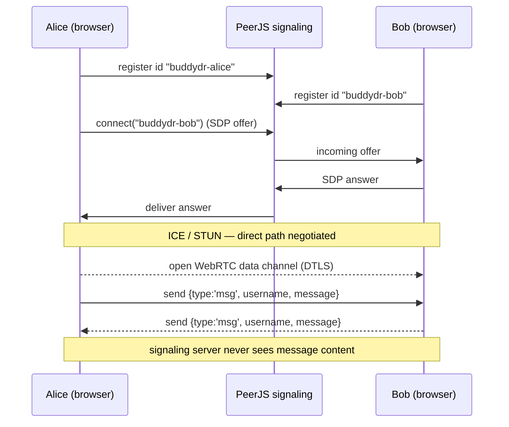
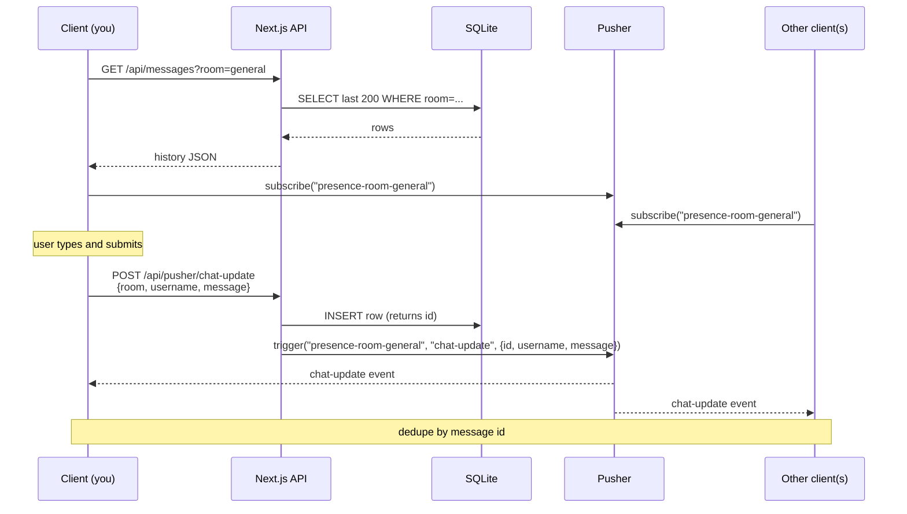
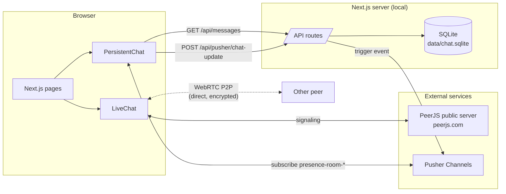

# baat-E

A no-login chat app. Pick a username, pick a mode, start chatting.

Two modes share the same UI:

- **Live (P2P)** — direct browser-to-browser chat over WebRTC (PeerJS). No server sees the messages, no history is kept. Both people enter their own username and the other person's username; the connection is established when both are online.
- **Persistent rooms** — username + a room name. Messages are stored in SQLite and broadcast in real time via Pusher. Late joiners and page reloads see full history.

Built with Next.js (pages router), React, TailwindCSS, Pusher, PeerJS, and better-sqlite3.

## Running it

Prereqs: Node 18+ recommended (Node 20 works with the legacy-OpenSSL flag already baked into the scripts).

```bash
npm install
npm run dev
```

Then open <http://localhost:3000>.

### Environment

Create a `.env.local` with your Pusher Channels credentials:

```
app_id=...
key=...
secret=...
cluster=...
```

The client-side Pusher app key is currently hard-coded in [components/PersistentChat.js](components/PersistentChat.js) — replace it with your own.

PeerJS uses the public PeerServer at `peerjs.com` by default. No config required, but it is a third-party signaling server (see "Privacy" below).

## Flow

### Overall

```mermaid
flowchart TD
    Start([User opens /]) --> Login[Login screen]
    Login --> Mode{Choose mode}
    Mode -->|Live P2P| LiveInput["Enter your username<br/>+ other person's username"]
    Mode -->|Persistent| PersInput["Enter your username<br/>+ room name"]
    LiveInput --> RouteL[/chat]
    PersInput --> RouteP[/chat]
    RouteL --> LiveChat[LiveChat component]
    RouteP --> PersChat[PersistentChat component]

    LiveChat --> PeerOpen["Peer opens<br/>id = buddydr-yourname"]
    PeerOpen --> Try["peer.connect target"]
    Try --> Q{Connected?}
    Q -->|Yes| LiveLoop["Send/recv over<br/>WebRTC data channel<br/>(DTLS, ephemeral)"]
    Q -->|No| Retry["Wait 3 s, retry"]
    Retry --> Try
    LiveLoop -->|tab closed| Cleanup["peer.destroy()<br/>state cleared"]

    PersChat --> Hist["GET /api/messages?room=..."]
    Hist --> Sub["Subscribe to<br/>presence-room-<name>"]
    Sub --> PersLoop["Send via POST<br/>recv via Pusher event<br/>(history kept in SQLite)"]
```

### Live (P2P) — message path



### Persistent rooms — message path



### System overview



## How the two modes work

### Live (P2P)

- Peer ID is `buddydr-<sanitized-username>`. Each browser claims its own ID on the PeerJS server.
- Both peers try to connect to the other's ID. The retry loop (3 s) means it doesn't matter who joined first.
- Messages travel over a WebRTC data channel (DTLS-encrypted between the two browsers). Nothing is stored.
- When the tab closes, the peer is destroyed on the signaling server and the local message state is cleared.

### Persistent rooms

- Pusher presence channel name is `presence-room-<sanitized-room>`.
- `POST /api/pusher/chat-update` accepts `{ room, username, message }`, inserts a row into SQLite, then triggers a `chat-update` event on the room's channel.
- On mount, the client fetches the last 200 messages via `GET /api/messages?room=…`, then subscribes to live updates. Messages are deduped by `id` so the live broadcast doesn't double-up with the history fetch.
- SQLite DB lives at `data/chat.sqlite` (gitignored). Schema is created on first use.

## Project layout

```
components/
  ChatLayout.js     header + scrollable messages + input bar
  ChatList.js       message bubble (own vs other)
  LiveChat.js       PeerJS 1:1 view
  PersistentChat.js Pusher + SQLite room view
  SendMessage.js    input + send button
  Button.js         primary button
  LeftPanel.js      legacy sidebar (unused after redesign, kept for reference)
lib/
  db.js             SQLite (better-sqlite3) helpers + sanitizeRoom
  pusher.js         server-side Pusher client
  init-middleware.js  unused helper
pages/
  _app.js           top-level state (username, mode, target, room)
  index.js          login screen with mode toggle
  chat.js           routes to LiveChat or PersistentChat
  api/
    messages.js              GET history for a room
    pusher/
      auth/index.js          presence-channel auth handler
      chat-update.js         POST a message (persist + broadcast)
      index.js               unused legacy public-channel handler
styles/
  globals.css       Tailwind + glassmorphism (.glass, .app-bg, bubbles)
tailwind.config.js  Tailwind v3 config
```

## Theme

Dark glassmorphism over a near-black backdrop with purple/violet ambient glows. Tokens live in [styles/globals.css](styles/globals.css):

- `.app-bg` — page background with radial glows + masked grid
- `.glass`, `.glass-strong`, `.glass-inner` — frosted surfaces, in increasing prominence
- `.glass-input` — translucent input with focus glow
- `.btn-primary`, `.btn-ghost` — gradient + ghost buttons
- `.bubble-mine`, `.bubble-theirs` — purple-gradient vs translucent bubbles
- `.brand-gradient` — text-fill gradient for the wordmark

## Privacy

- **Live mode**: message content is encrypted end-to-end (WebRTC DTLS). The PeerJS signaling server sees peer IDs and connection metadata but not message text. Your IP is exposed to the other peer (via STUN). Nothing is persisted.
- **Persistent mode**: messages are stored in plaintext in the local SQLite file, and broadcast through Pusher. Anyone who knows the room name and Pusher app key can read it. Treat persistent rooms as semi-public.

For stronger guarantees: self-host PeerJS and force TURN-only relays for live mode; for serious threat models, use Signal / SimpleX / Briar rather than a custom WebRTC stack.

## Origin

Forked from a Pusher + Next.js example; the original demo is at <https://pusher-chat-app.vercel.app/>. This fork is not deployed.
